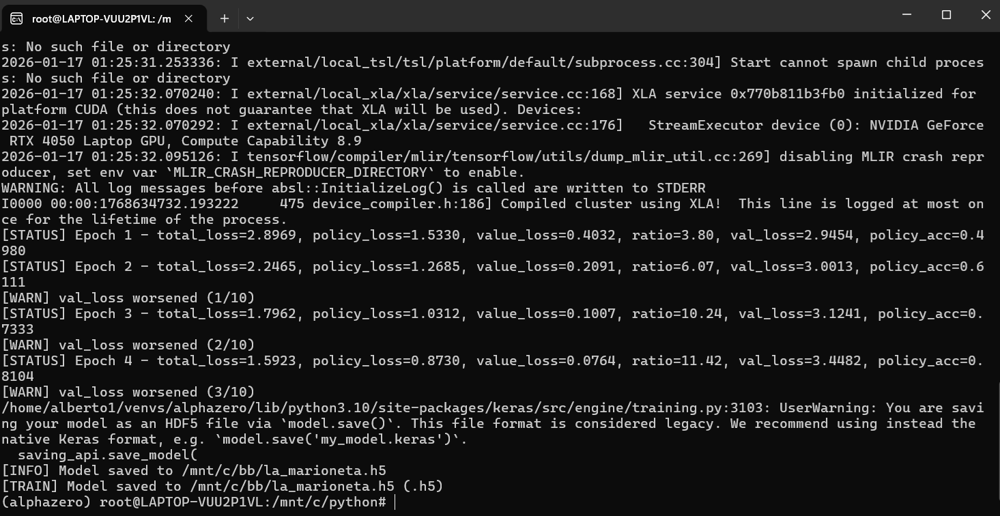

## Project Story

This whole thing starts from zero. Literally.  
BB‑Zero is my little experiment, my “baby zero,” to see how far a self‑learning engine can go in Spanish checkers. I’m not promising anything. Maybe it becomes strong, maybe it crashes and burns. That’s part of the fun.

Right now the engine plays terribly. It’s unstable, confused, and makes moves that would embarrass even a beginner. But that’s exactly how Leela Zero started too — the difference is that I want to document everything from day one. The chaos, the bugs, the weird behavior, the breakthroughs, the “why is this happening” moments… all of it.

The goal is simple: train a neural network from scratch and see what happens. Maybe one day BB‑Zero will be able to face real engines. Maybe not. Maybe the architecture is wrong, maybe the training pipeline explodes, maybe I can’t generate enough games. Whatever happens, it’s part of the experiment.

This repository is basically the diary of this little creature as it grows, learns, and hopefully becomes something interesting.

## Training Plan

I’ll start with 10,000 self‑play games at 100 simulations per move. After each batch, the network will train using a 50,000‑game window, picking examples at random so it doesn’t get stuck repeating the same patterns.

As BB‑Zero gets older and stops eating glue, I’ll slowly increase the simulations until reaching 800 per move. The long‑term goal is to reach at least 500,000 self‑play games. When that happens, I’ll try a match against Matilde from Checkerboard and see if this baby can walk on its own.

## Rule Verification and Capture Analysis

Before even thinking about training, I spent a lot of time checking the rules properly. I used combinatorial analysis and custom algorithms to explore every possible capture sequence a promoted piece can make — including all the closed paths that end on the same square but eat different pieces.

I didn’t do this alone. Herson P. Guier helped me a lot. He knows the rules of Spanish checkers inside out, and he’s famous for his work analyzing Profound, the strongest classical checkers engine ever made by the brilliant Álvaro Cardoso.

To support all this, I built a tool called Verifikator. I use it to check databases, detect illegal positions, and catch errors in my own engine through logs. It has saved me from many headaches.

## Current State of the Project

Right now BB‑Zero is a full “all‑inclusive resort,” just like the ones in Cancún — it has a little bit of everything. The whole program is written 100% in Python, running on an RTX‑4050 with CUDA, TensorFlow, and Keras doing all the heavy lifting. I also use workers to generate datasets in parallel, because this baby needs a lot of food to grow.

BB‑Zero currently includes three main modes, all integrated in the same program — a single Python application:

- **Gameplay mode**  
- **Dataset creation mode**  
- **Training mode**

The engine runs on both Windows and Linux, and it’s bilingual (Spanish and English), depending on what mood I’m in. It has a GUI, it trains, it generates datasets, it logs everything, it plays music and sound effects, and sometimes it even behaves. Basically, it’s an estuche de monerías — a small box full of surprises.

Even though it has all these features, the engine still plays terribly. It’s a newborn. But that’s the whole point: start from zero, document everything, and see how far this little creature can go.

After the first big test — once BB‑Zero reaches 500,000 self‑play games and faces Matilde — if people show interest, I would like to release the full source code. That way anyone can help improve it, use it for their own projects, or even build something better. The idea is to share the journey and maybe inspire others to create their own engines.

## Acknowledgments

Special thanks to Herson P. Guier, author of the “Damas Clásicas Españolas” Blogspot page. He has been my consultant, my rule expert, and my technical analyst. His explanations and insights helped me understand the deeper parts of the game and inspired many ideas behind BB‑Zero.

And of course, respect to Álvaro Cardoso, creator of Profound — the Stockfish of Spanish checkers. Profound is a monster, a true beast of an engine, and honestly it would be a dream to face it someday in the far future. Maybe BB‑Zero will get there, maybe not, but dreaming is free.

## Project Goal

The goal is simple: start this baby from zero and see how far it can go.  
Learn how to train it, watch it grow, and enjoy the journey — whether it becomes strong or stays as a cute disaster forever.

## Author

**Alberto Cervantes**  
Creator of BB‑Zero, an experimental AlphaZero‑style engine for Spanish checkers.

**Herson P. Guier (Costa Rica)**  
Analyst & Technical Advisor

## GUI Preview

Below are screenshots of the current GUI:

### Gameplay Mode

### Dataset Creation Mode

### Training Mode

### Menu Options

