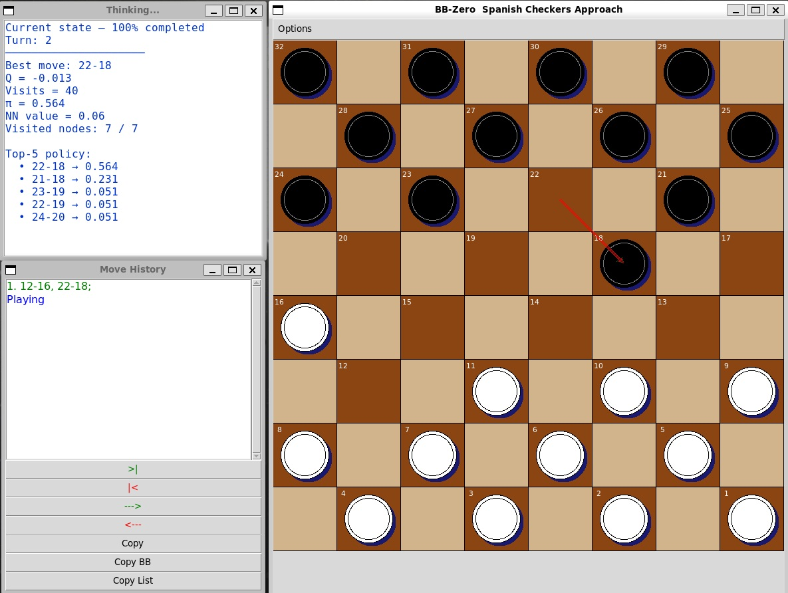

## BB‑Zero — Project Overview

BB‑Zero is an AlphaZero‑style engine for Spanish checkers, using PUCT, Monte Carlo Tree Search, Dirichlet noise, temperature, and pure self‑play reinforcement learning with no heuristics.

The first full version of the program was completed on January 16, 2026. The next phase now begins: generating all training datasets from scratch and documenting the entire process as the project evolves.

The engine is written 100% in Python as a single .py file, fully bilingual (Spanish/English), and compatible with both Linux and Windows.

BB‑Zero includes three integrated modes:
- Play Mode  
- Dataset Creation Mode  
- Training Mode  

Once training is completed, BB‑Zero will be released as a Windows executable (~10 MB) together with its neural network *La_Marioneta* (~15 MB), allowing anyone to play with it.

Special thanks to **Herson P. Guier**, my consultant and rule expert, whose deep knowledge of Spanish checkers has been essential to this project.

**Author:** Alberto Cervantes  

**Keywords:** Spanish checkers, Spanish draughts, classical draughts, Spanish draughts engine, AlphaZero, AI, Monte Carlo, reinforcement learning, PUCT, neural networks.

## GUI Preview

Below is an screenshots of the current GUI:

### Gameplay Mode

