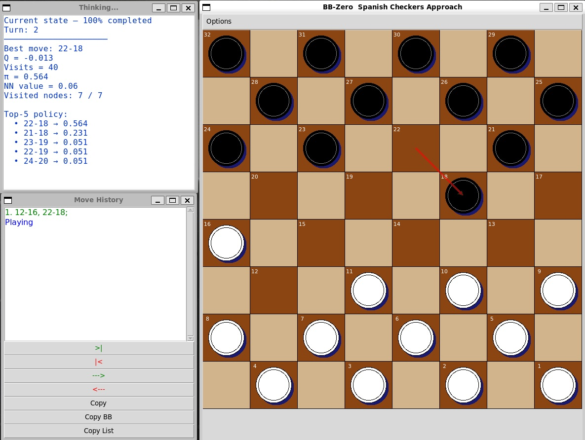

## BB‑Zero — Project Overview

BB‑Zero is an AlphaZero‑style engine for Spanish checkers, using PUCT, Monte Carlo Tree Search, Dirichlet noise, temperature, and pure self‑play reinforcement learning with no heuristics. The first full version of the program was completed on January 16, 2026. The next phase now begins: generating all training datasets from scratch and documenting the entire process as the project evolves.

The engine is written 100% in Python as a single .py file and is compatible with both Linux and Windows. BB‑Zero includes three integrated modes: Play Mode, Dataset Creation Mode, and Training Mode.

My long‑term goal is clear: **to challenge and eventually defeat Profound**, one of the strongest Spanish checkers engines documented on **Herson P. Guier’s Spanish Checkers Programs** page:  
https://damasclasicas.blogspot.com/

The project is estimated to be completed around **June 2026**.

---

## Current Status

During the early months of 2026, I validated the full BB‑Zero training pipeline using a reduced “mini‑brain” network. This process revealed several structural issues in my original AlphaZero implementation. The most important one was discovered in April: a mistake in how I handled the origin plane inside the policy tensor. This bug distorted the π targets and silently damaged the training process. After identifying the issue, I rebuilt the policy‑generation logic and fully corrected the origin‑plane handling. With this fix in place, the training pipeline stabilized and the self‑play data became consistent.

During the same refactor, I also developed a new memory‑efficient approach inspired by the idea of persistent search trees, but without relying on a classical tree structure. This design will be documented under technical_data soon.

---

## GUI Video

A short demonstration of the BB‑Zero GUI is available here: (Please note: the neural network shown here has not been trained correctly yet.)

https://www.youtube.com/watch?v=9LgB3CJ3WV4

---

## Release Plan

Once training is completed, BB‑Zero will be released as a Windows executable (~180 MB) together with its neural network *La_Marioneta* (~15 MB), allowing anyone to play with it.

---

## Acknowledgments

Special thanks to **Herson P. Guier**, my consultant and rule expert, whose deep knowledge of Spanish checkers has been essential to this project.

**Author:** Alberto Cervantes  
**Keywords:** Spanish checkers, Spanish draughts, classical draughts, Spanish draughts engine, AlphaZero, AI, Monte Carlo, reinforcement learning, PUCT, neural networks.

---

## GUI Preview

Below is a screenshot of the current GUI: (Please note: the neural network shown here has not been trained correctly yet.)

### Gameplay Mode

