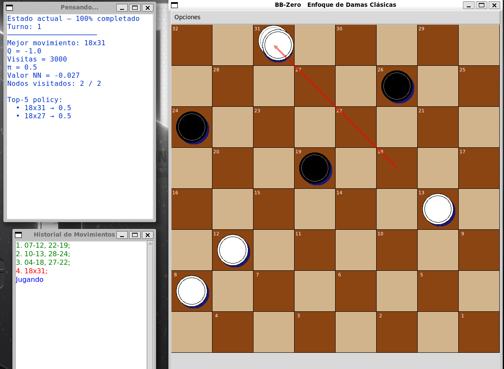

## BB‑Zero — Descripción General del Proyecto

BB‑Zero es un motor estilo AlphaZero para damas españolas, utilizando PUCT, Monte Carlo Tree Search, ruido Dirichlet, temperatura y autoentrenamiento puro sin heurísticas. La primera versión completa del programa se terminó el 16 de enero de 2026. La siguiente fase comienza ahora: generar todos los conjuntos de datos de entrenamiento desde cero y documentar todo el proceso conforme el proyecto avanza.

El motor está escrito 100% en Python dentro de un solo archivo .py y es compatible con Linux y Windows. BB‑Zero incluye tres modos integrados: Modo de Juego, Modo de Creación de Datasets y Modo de Entrenamiento.

Mi objetivo a largo plazo es claro: **desafiar y eventualmente derrotar a Profound**, uno de los motores más fuertes de damas españolas documentado en la página **Programas de Damas Clásicas de Herson P. Guier**:  
https://damasclasicas.blogspot.com/

Se estima que el proyecto estará terminado alrededor de **mayo de 2026**.

---

## Estado Actual

Entre el 18 de enero y el 12 de febrero validé todo el pipeline de entrenamiento de BB‑Zero usando una red reducida (“mini‑brain”). Esta prueba reveló varios problemas estructurales, los cuales corregí comparando con **AlphaCheckers‑Zero de MadrasLe**:  
https://github.com/MadrasLe/AlphaCheckers-Zero

Solo se usaron ideas conceptuales (ORIGIN y MASK). **No se utiliza ningún código externo de AlphaCheckers‑Zero en BB‑Zero.**

En marzo de 2026 descubrí varios errores en mi implementación original de AlphaZero — problemas causados por mi propia mala interpretación de cómo funciona realmente el algoritmo. Después de corregir estos errores, desarrollé una nueva idea que mejora el árbol persistente de DeepMind: un enfoque más eficiente, que evita la estructura clásica de árbol y prácticamente no usa RAM. Si te interesa este concepto, está documentado aquí en GitHub en **technical_data**.

---

## Video de la GUI

Aquí puedes ver una demostración corta de la interfaz gráfica de BB‑Zero.  
(Nota: la red neuronal mostrada aquí aún no ha sido entrenada correctamente.)

https://www.youtube.com/watch?v=9LgB3CJ3WV4

---

## Plan de Publicación

Una vez completado el entrenamiento, BB‑Zero se publicará como un ejecutable para Windows (~180 MB) junto con su red neuronal *La_Marioneta* (~15 MB), permitiendo que cualquiera pueda jugar con él.

---

## Agradecimientos

Agradecimientos especiales a **Herson P. Guier**, mi consultor y experto en reglas, cuyo profundo conocimiento de las damas españolas ha sido esencial para este proyecto.

**Autor:** Alberto Cervantes  
**Palabras clave:** damas españolas, Spanish checkers, damas clásicas, motor de damas, AlphaZero, IA, Monte Carlo, reinforcement learning, PUCT, redes neuronales.

---

## Vista Previa de la GUI

A continuación se muestra una captura de pantalla de la GUI actual.  
(Nota: la red neuronal mostrada aquí aún no ha sido entrenada correctamente.)

### Modo de Juego

