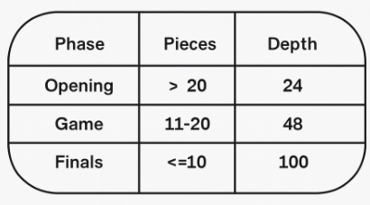

### MCTS Architecture Summary

BB‑Zero uses a lightweight MCTS architecture optimized for speed and stable learning.  
The search performs full expansion only at the root node: the root children receive neural‑network priors, value estimates, Dirichlet noise, and complete MCTS statistics (W, N, Q). This is the only part of the tree that is stored and updated across all simulations.

During the descent phase, deeper nodes are generated temporarily to continue the simulation, but they are not stored or expanded into a persistent tree. These nodes receive uniform priors and are discarded after each simulation. The neural network is evaluated only at the root and at the final leaf of each rollout, which keeps the search fast and predictable.

Other MCTS designs expand and store nodes at every depth, evaluating the neural network whenever a new leaf is reached and growing a full search tree. BB‑Zero intentionally uses a shallower expansion model to reduce branching factor, minimize network evaluations, and maintain efficient performance with its 14 MB residual network.

BB‑Zero’s neural network is implemented in TensorFlow, running inside a WSL2 (UbuntuCustom) environment on Windows 11, configured to use the CUDA‑accelerated GPU cores of an NVIDIA RTX‑4050. This setup allows the engine to perform fast batched inference despite being written in Python, providing stable training throughput and consistent performance during self‑play cycles.

To prevent **catastrophic forgetting**, BB‑Zero uses a modified sliding‑window training strategy.  
Instead of keeping a large historical buffer, the system retains only **the most recent 20% of self‑play data**.  
For example, when training with 12,000 games, only the latest 2,000 are preserved.  
All samples are fully shuffled before being fed into the ResNet, ensuring diversity while maintaining recency‑based stability.

In BB‑Zero, **depth** does not mean the same as in a traditional minimax engine.
It is not a “search tree depth” used to calculate long variations.

Instead:

**Depth** is a safety limit that prevents BB‑Zero from getting stuck in overly long simulations or endless loops. Originally set to 65, it was later modified after cycle 10 to improve endgame performance.

## January 20, 2026 — Small‑Brain Testing

With the results from the full self‑play game logs and their metrics, I realized that the network was not learning when I configured my program similar to MadrasLe’s setup, using a small neural network like his. That comparison made the issue obvious and helped me identify and fix several errors in my Python implementation.

Worker,Result,Moves,Q,π,Backprop,Start,End,Duration

w1,-1,Movs: 7-12 16x7 3x12 20-16 11-15 16x7 15x22 27x18 13x22 21-17 4x11 17-13 9x18 32-28 8-12 28-24 11-15 29-26 22x29 31-28 5-10 23-20 18-21 20x11 10-14 25x18 14x21 11-7 21-25 7-4 29-15 4-7 2-6 7x16 15-19 16-20 19x32 20x2 25-29 2-9 1-5 9x2 29-25 2-15 25-29 15-8 32-23 30-26 29x15 8x19x28,Q: -1.000 1.000 -1.000 1.000 -1.000 1.000 -1.000 1.000 -1.000 1.000 -1.000 1.000 -1.000 1.000 -1.000 1.000 -1.000 1.000 -1.000 1.000 -1.000 1.000 -1.000 1.000 -1.000 1.000 -1.000 1.000 -1.000 1.000 -1.000 1.000 -1.000 1.000 -1.000 1.000 -1.000 1.000 -1.000 1.000 -1.000 1.000 -1.000 1.000 -1.000 1.000 -1.000 1.000 -1.000 1.000,π: 0.300 1.000 1.000 0.863 0.938 1.000 0.988 1.000 0.550 0.963 1.000 0.988 1.000 1.000 0.500 0.988 0.962 0.988 1.000 0.988 0.688 0.975 0.975 0.988 1.000 1.000 1.000 0.988 1.000 0.975 1.000 0.200 0.975 1.000 1.000 0.988 1.000 1.000 0.975 0.338 1.000 1.000 0.988 0.988 1.000 0.950 0.975 0.900 0.412 1.000,Retro: Q+=30371 Q-=27850 depth_max=40 depth_avg=11.1,Start: 2026-01-18T07:09:14.410968,End: 2026-01-18T07:11:13.317792,Duración: 0:01:58.906824

...

w1,-1,Movs: 13-17 31-28 17x26 30x21 11-14 19x10 5x14 21-17 7-12 16x7 4x11 17-13 9x18 29-26 14-19 23x14x7 3x12 27-22 18x27 28-24 12-15 20x11 27-31 26-22 31x18x7 32-28 7-21 25x18 8-12 18-14 1-5 14-11 12-16 28-23 16-20 24x15 2-6 11x2 5-10 23-19 10-14 19x10,Q: -1.000 1.000 -1.000 1.000 -1.000 1.000 -1.000 1.000 -1.000 1.000 -1.000 1.000 -1.000 1.000 -1.000 1.000 -1.000 1.000 -1.000 1.000 -1.000 1.000 -1.000 1.000 -1.000 1.000 -1.000 1.000 -1.000 1.000 -1.000 1.000 -1.000 1.000 -1.000 1.000 -1.000 1.000 -1.000 1.000 -1.000 1.000,π: 0.387 0.638 1.000 0.625 0.788 1.000 1.000 0.988 0.888 1.000 0.950 0.975 1.000 0.588 0.975 1.000 1.000 0.975 1.000 0.850 0.613 1.000 0.938 0.963 0.500 0.762 0.988 1.000 0.438 0.925 0.950 0.963 0.812 0.988 0.425 0.663 0.387 1.000 0.750 0.625 0.950 1.000,Retro: Q+=29841 Q-=28342 depth_max=55 depth_avg=13.4,Start: 2026-01-19T14:32:58.368101,End: 2026-01-19T14:34:03.832981,Duración: 0:01:05.464880

---------

## January 25, 2026 - Testing the corrections

After fixing several issues in the training process, I validated the corrections using a controlled 5‑men vs 2‑men endgame test. The goal was to confirm whether the small‑network configuration (similar to MadrasLe’s setup - 80 simulations) was now capable of learning.

The test confirmed correct behavior: BB‑Zero is learning.  
The policy became more structured, MCTS exploration improved, and gameplay showed coherent tactical understanding.  
BB‑Zero also achieved its first real win against Matilde (an expert‑level Spanish checkers engine compatible with Martin Fierz’s CheckerBoard)  , converting a positional advantage with a clean tactical sequence (8x15).

## Self‑Play & Training Metrics (24‑Game Window)

### Cycle 1 → Cycle 4 Trends
- visited_nodes: 1–3 → 5–6
- policy_acc: 0.36 → 0.48
- value_loss: 0.36 → 0.22
- policy_loss: 1.94 → 1.47
- total_loss: 2.83 → 2.10
- Draws: appear starting in Cycle 3
- Gameplay: stable Q-values, clearer π, better depth consistency

### Cycle Highlights
- Cycle 1: noisy policy, shallow exploration
- Cycle 2: π stabilizes, exploration improves
- Cycle 3: first real draws, finer policy
- Cycle 4: strongest cycle; BB‑Zero defeats Matilde (8x15)

## Conclusion
- The 24‑game window accelerates early learning.
- The value head matures quickly (0.22 by Cycle 4).
- MCTS exploration becomes more efficient (5–6 children visited).
- The network begins recognizing tactical patterns and converting advantages.
- First verified win against Matilde confirms correct learning behavior.

